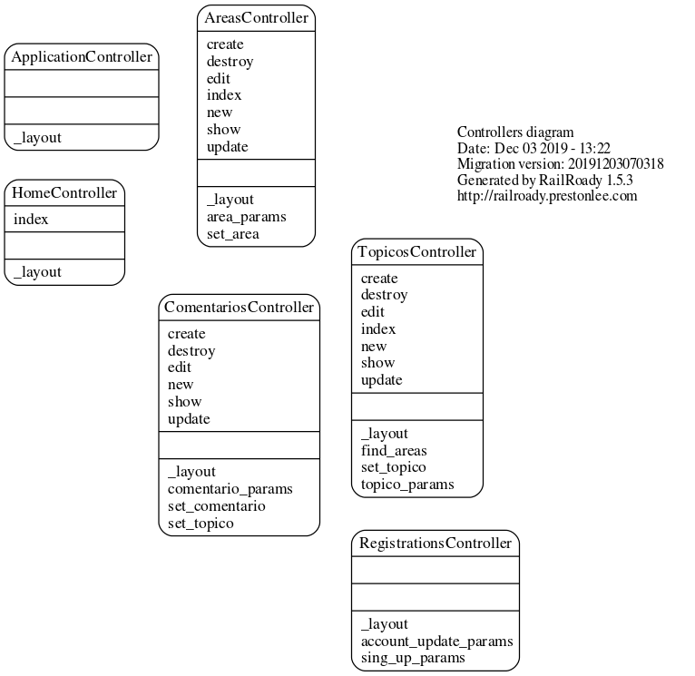
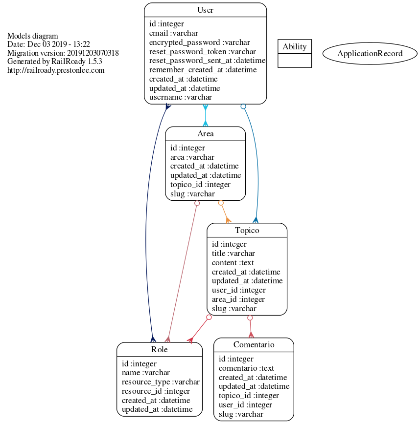
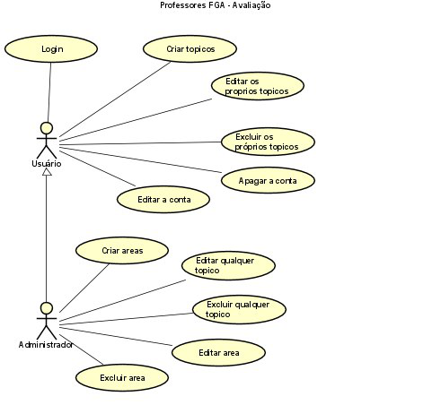

# Professores FGA - Avaliação

# Objetivo

O objetivo desse projeto foi criar um fórum para discussão e avaliação dos professores da FGA de forma organizada. Com isso, o aluno pode visualizar informações
da didática do professor e avaliações sobre ele.

# Como usar

1. Faça o clone do repositório ou faça o download dele.
```shell
   $git clone https://gitlab.com/ProgrammerSpinosa/projetoforum.git
```
2. Vá até a pasta e utilize os comandos bundle install e rails db:migrate
```shell
   $ bundle install
   $ rails db:migrate
```

3. Inicie a aplicação com o comando rails s e, depois, basta ir até o servidor.
```shell
   $ rails s
```

4. Para criar um administrador, use os seguintes comandos com o terminal aberto na pasta do projeto
```shell
    rails console
    @user = User
    @user.connection
    @user.all
    @user = User.find(id_do_usuário (Por exemplo, o primeiro usuário cadastrado tem id igual a 1))
    @user
    @user.add_role "admin"
    @user.save
```

# Funcionalidades

**Visitante (pessoa sem cadastro)** 

* Pode visualizar tópicos criados por membros e administradores.

* Pode criar uma conta no fórum, se tornando membro dele.

**Membro**

* Pode criar tópicos em uma área do fórum.

* Pode excluir/editar tópicos criados por si mesmo.

* Pode apagar a própria conta.

* Pode editar o nome de usuário, senha e email da própria conta.


**Administrador**

* Pode criar tópicos em uma área do fórum.

* Pode criar áreas no fórum.

* Pode editar/excluir qualquer tópico do fórum.

* Pode editar/excluir qualquer área do fórum.

* Pode apagar a própria conta.

* Pode editar o nome de usuário, senha e email da própria conta.


# Diagramas

**Diagrama de Controllers**


    
**Diagrama de Models**



**Diagrama de casos de uso**

